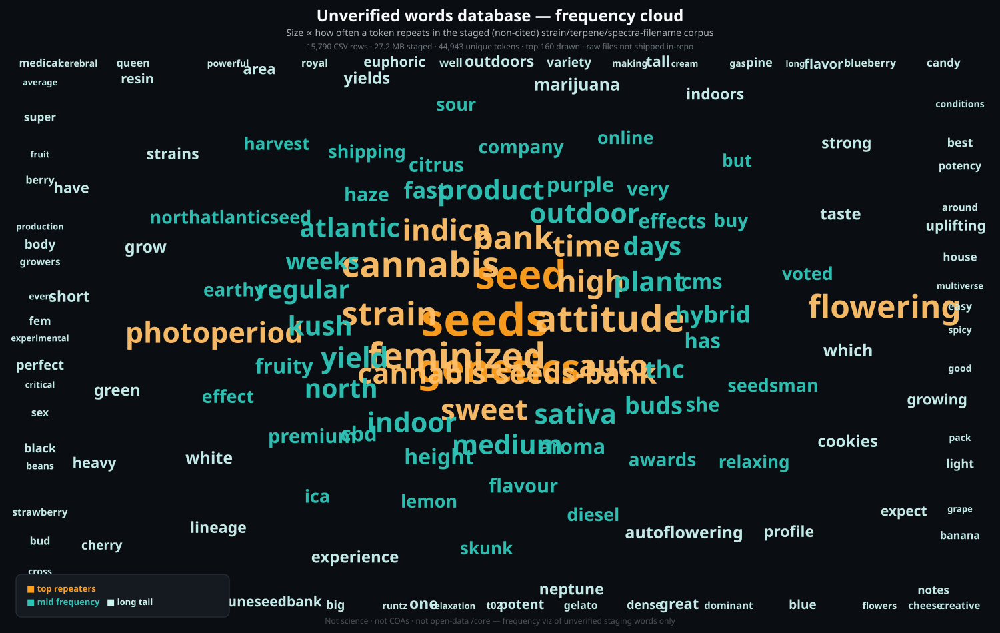

# CMIP — Cannabis Molecular Intelligence Platform

**Status:** schema and architecture notes. **No code and no lab data** live in this repo yet.

<p align="center">
  
</p>

<p align="center"><em>Origin storyboard — founder FaceID panels via <a href="https://github.com/the1truedan/mok-tua">mok-tua</a> (local Comfy, not Imagine). Identity from the public <a href="https://github.com/the1truedan/mok-tua/blob/main/docs/assets/pres-smoke/00-ceo-source-still.jpg">ceo forehead source still</a>. Full strip: <a href="docs/assets/origin-storyboard/">docs/assets/origin-storyboard/</a>.</em></p>

## Why this exists

Most “terpene databases” are giant spreadsheets: the same molecule appears under five spellings, boiling points show up as bare numbers with no source, and aroma wheels get mixed into chemistry columns. CMIP is a design for doing that job properly — one place for compounds, cultivars, lab COAs, and the links between them — so charts and tools can share a single backbone.

## Design principles

- **One row per real chemical.** Everything else points at it; do not paste the same molecule into ten tables.
- **Numbers need a story.** A boiling point is not just `177` — units, method, citation, and confidence travel with the value.
- **Isomers stay distinct.** α-pinene is not β-pinene; cis/trans matter for pathways and effects.
- **Pretty wheels are not chemistry.** Aroma/flavor/effect taxonomies sit beside the science, not inside the compound record.

## Layered architecture

```
Knowledge Layer (literature/patents)
  → Reference Tables
  → Chemistry
  → Cultivars
  → Lab Results (Certificates of Analysis)
  → Retail Products
  → Genetics
  → Visualization
```

## Core schema modules

- **Compounds** — the master registry  
- **Synonyms**  
- **Classification** — ontology tree (Organic Compound → Terpenoid → Monoterpenoid → …), not flat categories  
- **Functional Chemistry / Properties**  
- **Biological Activity** — `compound / target / effect / species / model / dose / citation / confidence`  
- **Protein Targets** · **Pathways** · **Measurements** · **Cultivars** · **Genetics**  
- **Lab Results (COAs)** · **Products** · **Labs / Instruments** · **References**  
- **Visualization layer** — kept separate from chemistry records  

## Storage recommendation (polyglot)

```
raw ingestion (versioned XML/JSON/CSV)
  → DuckDB + Parquet analytics warehouse
  → PostgreSQL canonical relational store
  → Neo4j/Memgraph for genetics & pathway graph queries
  → full-text + vector search (Postgres FTS+pgvector, or OpenSearch)
  → JSON/Parquet visualization-cache exports
```

## ETL as an immutable staged pipeline

```
/raw      unchanged sources
/staging  parsed, normalized, validated
/core     compounds, cultivars, measurements, references
/marts    derived exports — terpene_wheel.csv, cannabinoid_summary.csv,
          cultivar_profiles.parquet, aroma_network.json
```

## Open data first

Planned sourcing (named licenses, no mystery CSVs) is documented in:

- [docs/OPEN_DATA_SOURCE_PATHWAYS.md](docs/OPEN_DATA_SOURCE_PATHWAYS.md) — module → public sources with **URL hyperlinks**
- [docs/CONVERSATION_PROVIDERS.md](docs/CONVERSATION_PROVIDERS.md) — how multi-provider design chats are attributed (Grok, ChatGPT, Claude, local models, etc.)

### Withheld pile — words only, not science

An earlier opportunistic data pile (strain CSV, structure export, spectra, partial Excel) was **never confirmed** for redistribution. It is **not** in this repo and is **not** cited as chemistry evidence. The only public treatment is a **lexical context** viz — word sizes reflect narrative weight in the open-data pivot, not lab measurements:

<p align="center">
  
</p>

<p align="center"><em>Not science · not COAs · not compound rows — context words about why that pile stayed out. Pathways: <a href="docs/OPEN_DATA_SOURCE_PATHWAYS.md">OPEN_DATA_SOURCE_PATHWAYS.md</a>.</em></p>

## Federal scheduling context (Schedule III)

President **Donald J. Trump** signed the 18 December 2025 executive order  
[**Increasing Medical Marijuana and Cannabidiol Research**](https://www.whitehouse.gov/presidential-actions/2025/12/increasing-medical-marijuana-and-cannabidiol-research/),  
directing the Attorney General to complete rulemaking toward **rescheduling marijuana to Schedule III** of the CSA (see also the [White House fact sheet](https://www.whitehouse.gov/fact-sheets/2025/12/fact-sheet-president-donald-j-trump-is-increasing-medical-marijuana-and-cannabidiol-research/)).  

That EO sits on top of the earlier **May 2024** DOJ/DEA [NPRM](https://www.federalregister.gov/documents/2024/05/21/2024-11137/schedules-of-controlled-substances-rescheduling-of-marijuana) and later DOJ medical-product actions. **Precision matters:** presidential direction ≠ every last CSA row rewritten by ink alone — details and primary links live in:

- [docs/FEDERAL_CANNABIS_RESCHEDULING_CONTEXT.md](docs/FEDERAL_CANNABIS_RESCHEDULING_CONTEXT.md)

CMIP remains **schema + open-source pathways**, not a compliance product.

## What's deliberately not in this repo

No real compound, strain, or spectral data ships here — schema and architecture only. Builders must source licensed chemistry/strain data themselves and respect redistribution terms. The non-confirmed private staging pile is **withheld**, not republished.

## Origin (public)

CMIP grew from the need for a **provenance-first** chemistry backbone: messy spreadsheet “databases” kept colliding with caregiving and lab-ops work. Early exploration mixed spreadsheet drafts and multi-provider design conversations; those drafts are **not** published here. This repository is the **docs-only architecture sketch** after a deliberate pivot to open, citable sources.

**Timeline anchors:** exploratory design from **22 March 2026**; caregiving focus from **13 April 2026**; public architecture sketch late **July 2026**; Schedule III policy context documented **August 2026**.

Design conversation providers used across that arc (not data sources) are listed in [docs/CONVERSATION_PROVIDERS.md](docs/CONVERSATION_PROVIDERS.md).

## License

MIT — see [`LICENSE`](LICENSE).

## Non-affiliation

This is an independent architecture sketch, not affiliated with, endorsed by, or sponsored by any lab, vendor, or database linked in the docs.

---

<p align="left">
  <a href="https://linktr.ee/the1truedan"></a>
  <a href="https://ko-fi.com/the1truedan"></a>
</p>

**© 2026 M.A.N.A.G.E.R. LLC** — *prepare for the care when we cannot be there*
